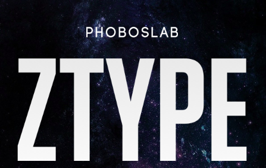

<!--
*** Thanks for checking out the Best-README-Template. If you have a suggestion
*** that would make this better, please fork the repo and create a pull request
*** or simply open an issue with the tag "enhancement".
*** Thanks again! Now go create something AMAZING! :D
-->


<!-- PROJECT SHIELDS -->
<!--
*** I'm using markdown "reference style" links for readability.
*** Reference links are enclosed in brackets [ ] instead of parentheses ( ).
*** See the bottom of this document for the declaration of the reference variables
*** for contributors-url, forks-url, etc. This is an optional, concise syntax you may use.
*** https://www.markdownguide.org/basic-syntax/#reference-style-links
-->


<!-- PROJECT LOGO -->
<br />
<p align="center">
  <a href="https://github.com/AlejandroUPC/ztypebot">
    
  </a>

  <h3 align="center">Python Ztype bot</h3>

  <p align="center">
    An approach to solve a speed-typing game using Python!
  </p>
</p>


<!-- TABLE OF CONTENTS -->
<details open="open">
  <summary>Table of Contents</summary>
  <ol>
    <li>
      <a href="#about-the-project">About The Project</a>
      <ul>
        <li><a href="#built-with">Built With</a></li>
      </ul>
    </li>
    <li>
      <a href="#getting-started">Getting Started</a>
      <ul>
        <li><a href="#prerequisites">Prerequisites</a></li>
        <li><a href="#installation">Installation</a></li>
      </ul>
    </li>
    <li><a href="#usage">Usage</a></li>
    <li><a href="#roadmap">Roadmap</a></li>
    <li><a href="#license">License</a></li>
    <li><a href="#contact">Contact</a></li>
    <li><a href="#acknowledgements">Acknowledgements</a></li>
  </ol>
</details>


<!-- ABOUT THE PROJECT -->
## About The Project

[![Main Window][main-window]](https://zty.pe)

After looking into some typing games came across this project from [PHOBOSLAB](https://tzy.pe), and just wanted to try a way to automate the process!
There is room for improvemenet, obviously, and the computer I used was kind of slow grabbing the images and processing them, so feel free to comment and contribute.

### Built With

The Python modules used to build this project are:

* [PyAutoGUI](https://pyautogui.readthedocs.io/en/latest/): Screenshot grab.
* [Pynput](https://pypi.org/project/pynput/): Key strokes.
* [Pytesseract](https://pypi.org/project/pytesseract/): Extracting text from image.
* [Numpy](https://numpy.org/): Image operations such as filtering.
* [OpenCV](https://opencv.org/): Image processing.


<!-- GETTING STARTED -->
## Getting Started

The project is quite simple, it still requires some previous work like setting the coordinates of the window where the game is,
once you have them simply start the game, run the script and focus the window where the game is running. After 3 seconds (default for START_WAIT) the script will start

The logic of the game priorizes that when you start a word (turns into orange) you must type it fully before starting a new one, there is some filtering to processes the images in those situations.

Note that if the screen is not focused it can cause a little bit of a chaos and will start typing the words elsewhere!

### Prerequisites

You need to have Python >= 3.8 installed and then simply install the modules required by running the following command from the root folder.

* requirements.txt
  ```sh
  pip3 install -r requierements.txt
  ```

### Installation

1. You might have to install Tesseract followng [this guide](https://www.howtoforge.com/tutorial/tesseract-ocr-installation-and-usage-on-ubuntu-16-04/).
2. You might have to install OpenCV following [this guide](https://linuxize.com/post/how-to-install-opencv-on-ubuntu-20-04/).


<!-- USAGE EXAMPLES -->
## Usage

An example of how to use it with a 0.1 on ACTION_DELAY

[![Example Funct][demo-gif]]


<!-- ROADMAP -->
## Roadmap

* Sometimes when a Orange word gets stuck ,it takes too long to find it and remove it.

* Add distance to center (calculate the distance of the enemies to the spaceship) and add a panic button to hit the Enter key.


<!-- LICENSE -->
## License

Distributed under the MIT License. See `LICENSE` for more information.


<!-- CONTACT -->
## Contact

Alejandro Martínez - [Linkedin](https://www.linkedin.com/in/alejandro-martinez-otal/) - amartinezotal@gmail.com

Project Link: [zTypeBot](https://github.com/AlejandroUPC/ztypebot)


<!-- MARKDOWN LINKS & IMAGES -->
<!-- https://www.markdownguide.org/basic-syntax/#reference-style-links -->

[main-window]: imgs/main.png
[demo-gif]: imgs/sample_gif.gif